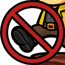

# Spelunky 2 - Steady footing

The "Steady footing" mod prevents players from losing balance and accidentally dropping held items. When teetering at edges, you never lose your balance.

## Features
- Disables the balancing behavior for players so they never wobble off edges
- Removes automatic item drop induced by balancing
- No configuration needed, installs and works by default

## Changelog

### 1.0
- **Added:**
  - Remove the balancing behavior observed for players standing at the edge of platforms
  - Ensures held items aren’t dropped when player is at edge

## Contributions
I welcome feedback, feature requests, and bug reports!